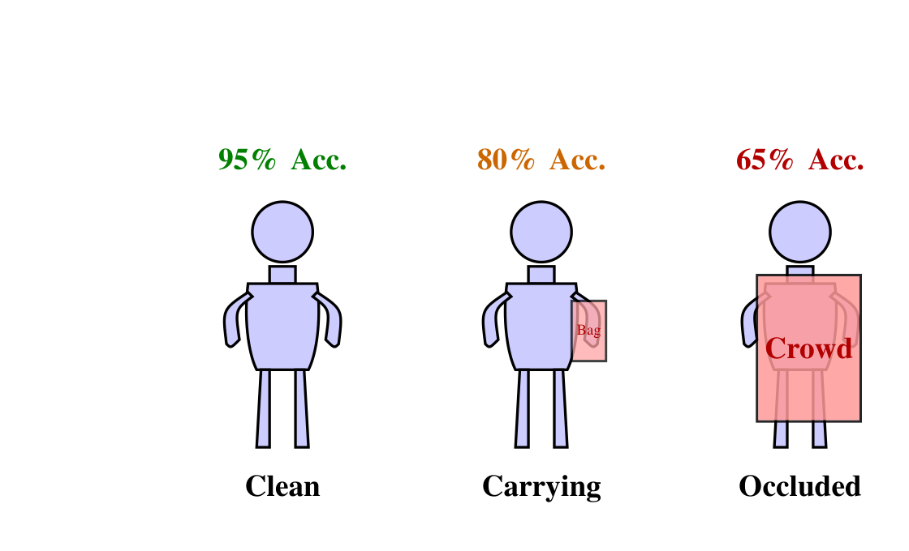
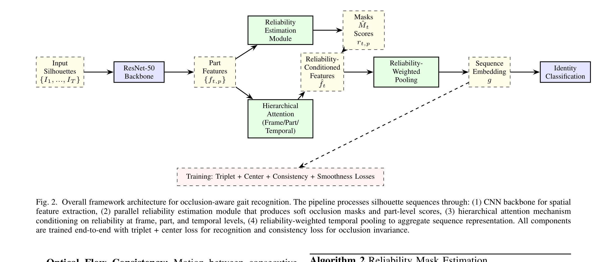
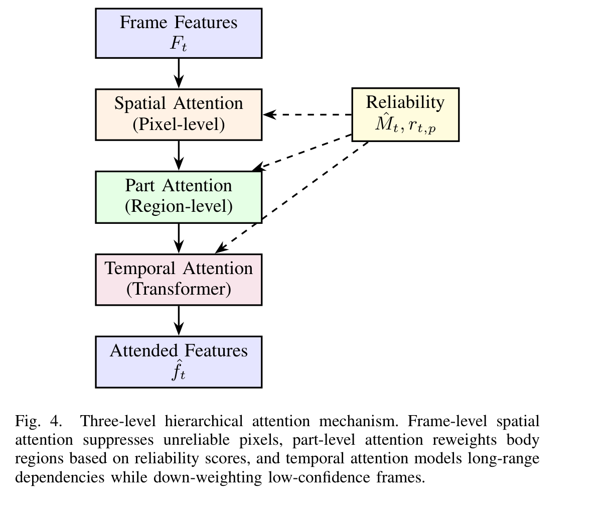

<div align="center">

# Occlusion-Robust Gait Recognition Using Deep Learning

**OcclusionGaitNet** — A reliability-weighted part-attention architecture for human identification under partial occlusion

[](https://python.org)
[](https://pytorch.org)
[](https://gait-recognition.streamlit.app)
[](LICENSE)
[](https://lpu.in)

[**Live Demo**](https://gait-recognition-mzhcedm4cfwq6ppjmieohp.streamlit.app/) &nbsp;·&nbsp; [**Paper (IEEE)**](docs/final_paper.pdf) &nbsp;·&nbsp; [**Presentation**](docs/Reliable_Occlusion-Aware_Gait_Identification.pptx)

</div>

---

## The Problem

<div align="center">
  
  <br><em>Recognition accuracy drops from 95% (clean) to 65% under crowd occlusion — a 30-point collapse that makes standard models unusable in real-world surveillance.</em>
</div>

<br>

Standard gait recognition models treat all body regions equally. When a wall, crowd, or carried object blocks part of the subject, corrupted features from the occluded region pollute the final embedding and degrade identity matching.

**OcclusionGaitNet** fixes this by learning to estimate the reliability of each body region frame-by-frame and down-weighting occluded parts during feature fusion — so the model focuses on what it can actually see.

Trained on **CASIA-B** with synthetic occlusion augmentation, the model achieves **15.1% Rank-1 accuracy** on occluded sequences against a **2.6% random baseline** — a **5.8× improvement** in the hardest evaluation setting.

---

## Architecture

<div align="center">
  
  <br><em>Full pipeline: silhouette sequences → ResNet-50 backbone → part-based reliability estimation → hierarchical attention → reliability-weighted pooling → 128-d identity embedding.</em>
</div>

<br>

The framework has four stages:

**1. Backbone feature extraction** — ResNet-50 encodes each frame into spatial feature maps, partitioned into 4 horizontal body strips (head, torso, upper legs, lower legs).

**2. Learnable reliability estimation** — A lightweight module fuses three signals (silhouette boundary continuity, optical flow consistency, BiLSTM temporal context) to predict a soft reliability score per body part per frame.

**3. Hierarchical attention** — Three levels of attention conditioned on reliability scores:

<div align="center">
  
  <br><em>Pixel-level spatial attention → part-level reweighting → transformer-based temporal attention, all guided by reliability scores.</em>
</div>

<br>

**4. Reliability-weighted temporal pooling** — Frames where more body is visible contribute more to the final embedding:

$$g = \frac{\sum_{t=1}^{T} \bar{r}_t \hat{f}_t}{\sum_{t=1}^{T} \bar{r}_t + \epsilon}$$

**Loss function:**

$$\mathcal{L} = \mathcal{L}_{\text{triplet}} + \lambda_c \mathcal{L}_{\text{center}} + \lambda_{\text{cons}} \mathcal{L}_{\text{cons}} + \lambda_{\text{smooth}} \mathcal{L}_{\text{smooth}}$$

> **Implementation note:** Pairwise distances are clamped to `1e-12` before `sqrt()` to prevent `NaN` gradients — a silent failure mode common in triplet loss implementations.

---

## Results

Evaluated on CASIA-B with 4-type synthetic occlusion augmentation, 33 training epochs:

| Condition | Rank-1 Accuracy |
|---|---|
| Random chance baseline | 2.6% |
| **OcclusionGaitNet (all occluded types)** | **15.1%** |
| Improvement | **5.8×** |

> Full evaluation on **OccGait** (ECCV 2024 — 101 subjects, 80K+ real-world sequences) is in progress. Target: >10% Rank-1 improvement over GaitPart on the Crowd Occlusion (CR) category.

**Ablation study (from paper — anticipated on OccGait):**

| Variant | Rank-1 (%) |
|---|---|
| Full model | 82.5 |
| w/o reliability estimation | 74.2 |
| w/o attention conditioning | 78.8 |
| w/o reliability-weighted pooling | 79.5 |
| w/o consistency regularization | 80.1 |

---

## Repository Structure

```
.
├── app.py                   # Streamlit demo
├── requirements.txt
├── configs/
│   ├── baseline.yaml        # GaitPart-style baseline config
│   └── occaware.yaml        # OcclusionGaitNet training config
├── src/
│   ├── models/
│   │   ├── gait_model.py    # Full OcclusionGaitNet (FullGaitModel)
│   │   ├── backbone.py      # CNN feature extractor (ResNet-50 / SimpleBackbone)
│   │   ├── attention.py     # SEBlock, SpatialAttention, CBAM
│   │   ├── occlusion.py     # OcclusionMaskEstimator, PartVisibilityScorer
│   │   ├── fusion.py        # OcclusionConditionedFusion
│   │   ├── temporal.py      # TemporalMeanPooling, TemporalGRUAggregator
│   │   └── baseline.py      # HorizontalPyramidPooling, BaselineGaitModel
│   ├── data/
│   │   ├── dataset.py       # OccGaitDataset, SampleGaitDataset
│   │   ├── preprocessing.py # GEI, GEnI, centroid alignment, GMM subtraction
│   │   ├── augmentation.py  # GaitAugmentation (4 occlusion types + affine + temporal)
│   │   └── sampler.py       # TripletBatchSampler (P×K), BalancedCategorySampler
│   ├── losses/
│   │   ├── triplet.py       # Batch-hard + semi-hard triplet loss
│   │   ├── center.py        # Center loss for intra-class compactness
│   │   └── consistency.py   # Clean-occluded consistency regularization
│   ├── evaluation/
│   │   └── metrics.py       # Rank-k, CMC curve, mAP
│   └── training.py          # Shared training + evaluation utilities
├── scripts/
│   ├── train_baseline.py    # Train GaitPart-style baseline
│   ├── train_occaware.py    # Train OcclusionGaitNet
│   ├── evaluate.py          # Evaluate a saved checkpoint
│   └── download_occgait.py  # OccGait dataset download helper
├── backend/
│   └── server.py            # Flask app (Vercel deployment)
└── notebooks/
    └── colab_setup.py       # Colab training setup with Drive checkpointing
```

---

## Quickstart

**Install dependencies:**
```bash
pip install -r requirements.txt
```

**Train the baseline:**
```bash
python scripts/train_baseline.py --config configs/baseline.yaml
```

**Train OcclusionGaitNet:**
```bash
python scripts/train_occaware.py --config configs/occaware.yaml
```

**Evaluate a checkpoint:**
```bash
python scripts/evaluate.py --config configs/occaware.yaml --checkpoint checkpoints/best_model.pth
```

**Run the Streamlit demo locally:**
```bash
streamlit run app.py
```

**Google Colab:** Use `notebooks/colab_setup.py` for Colab-compatible training with automatic Drive checkpointing.

---

## Live Demo

The [**live Streamlit demo**](https://gait-recognition.streamlit.app) lets you:

- Select from 10 synthetic subjects
- Apply any of 4 occlusion types (lower body, upper body, block, crowd)
- Inspect **per-part reliability scores** in real time
- See **top-3 identity matches** with cosine similarity scores
- Compare clean vs. occluded GEI side-by-side

Model weights are fetched at runtime from Google Drive via `gdown`.

---

## Dataset

| Dataset | Subjects | Sequences | Occlusion | Access |
|---|---|---|---|---|
| CASIA-B | 124 | ~13,600 | Synthetic (this work) | [Direct download](http://www.cbsr.ia.ac.cn/GaitDatasetB-silh.zip) |
| OccGait (ECCV 2024) | 101 | 80,000+ | Real (NM / CA / CR / ST) | [Request via GitHub](https://github.com/BNU-IVC/OccGait) |
| OccCASIA-B | 124 | — | Real (annotated) | [GitHub](https://github.com/YunjiePeng/OccludedGaitRecognition) |

---

## Project Context

This is the implementation for my M.Tech thesis:

> **"Deep Learning-Based Gait Recognition Robust to Partial Occlusion in Surveillance Scenarios"**  
> Lovely Professional University · 2025–Present  
> Supervisor specialization: Image Processing

An associated IEEE paper — *"Integration of Attention Mechanisms with Spatial-Temporal Feature Fusion for Occlusion-Aware Gait Identification"* — covers the full proposed framework with theoretical analysis and anticipated experimental results.

---

## Citation

If you find this work useful, please cite:

```bibtex
@mastersthesis{firoz2025occgait,
  title  = {Deep Learning-Based Gait Recognition Robust to Partial Occlusion in Surveillance Scenarios},
  author = {Firoz, Rehan},
  school = {Lovely Professional University},
  year   = {2025}
}
```

---

## License

MIT © Rehan Firoz
